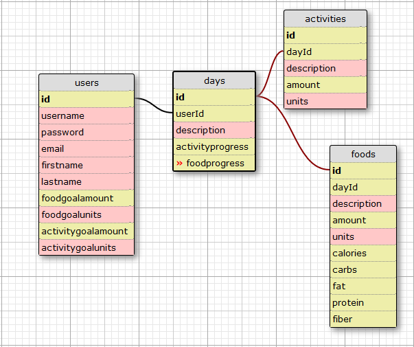

# FitHub

Version 0.1.0: 10, 2016

## Description
Epicodus JavaScript Week 5 Group Project by
* [Alexander Jacks](https://github.com/Adjectival)
* [Dean Scelza](https://github.com/d34n5)
* [Garrett Price](https://github.com/GarrettLeePrice)
* [Karen Freeman-Smith](https://github.com/karenfreemansmith)

An application to track progress on your health and fitness goals written with TypeScript, Sass, Angular 2, and Firebase

### Specifications
* Enter Foods:
  * Add or edit foods on the list to keep track of their nutritional qualities like calories, fat, carbs, protein (with the possibility of adding more nutritional data)
  * Allow user to look up foods from an API or enter them by hand.
  * Foods get an icon based on the category of the food
* Enter Meals:
  * Add or edit timestamp for meal
  * Add foods to a meal (with adjustable portion sizes to calculate their actual values)
  * Show a summary (possibly a graph) of nutrition by meal, day, week, etc.
* Set Diet Goals:
  * Set a target goal for daily diet (in calories/fat/carbs/protein etc)
* Enter Activities:
  * Add or edit activity goals
  * Record completed activities with percentage of goal reached
* Display daily progress with various colored squares for the past year
  * 5 colors (shown as opacity): ... all effort gets some reward, extra effort gets extra reward.
  * 10% opacity = ANY effort
  * 30% opacity = 33% effort (? should this be more, 50% maybe?)
  * 50% opacity = 67% effort (? if other is 50% should this be 75%, 90%?)
  * 70% opacity = 100% effort
  * 90% opacity > 100% effort
* Store data:
  * in local storage (if database is not possible)
  * or, preferably in database with user login
* (Optional...) Add results tracking (weight/inches):
  * Add new "check-in"
  * Display chart of all checkins for date range

#### Database Diagram

## Installation

* `git clone <repository-url>` this repository
* change into the new directory
* `npm install`
* `bower install`

## Running / Development

* `ember serve`
* Visit your app at [http://localhost:4200](http://localhost:4200).

### Running Tests

* `ember test`
* `ember test --server`

### Building

* `ember build` (development)
* `ember build --environment production` (production)

### Deploying

Specify what it takes to deploy your app.

## Further Reading / Useful Links

* [ember.js](http://emberjs.com/)
* [ember-cli](http://ember-cli.com/)
* Development Browser Extensions
  * [ember inspector for chrome](https://chrome.google.com/webstore/detail/ember-inspector/bmdblncegkenkacieihfhpjfppoconhi)
  * [ember inspector for firefox](https://addons.mozilla.org/en-US/firefox/addon/ember-inspector/)

  ## Support & Contact
  For questions, concerns, or suggestions please email karenfreemansmith@gmail.com

  ## Known Issues (*Desired Improvements*)
  *

  ## Technologies Used
  TypeScript, Angular2, Sass, Gulp, Bower

  ## Legal
  *Licensed under the GNU General Public License v3.0*

  Copyright (c) 2016 Copyright _[Alexander Jacks](https://github.com/Adjectival), [Dean Scelza](https://github.com/d34n5), [Garrett Price](https://github.com/GarrettLeePrice), [Karen Freeman-Smith](https://github.com/karenfreemansmith)_ All Rights Reserved.
